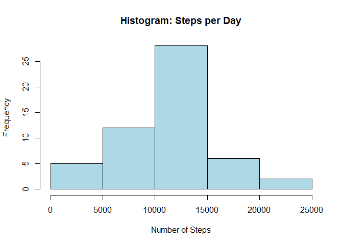
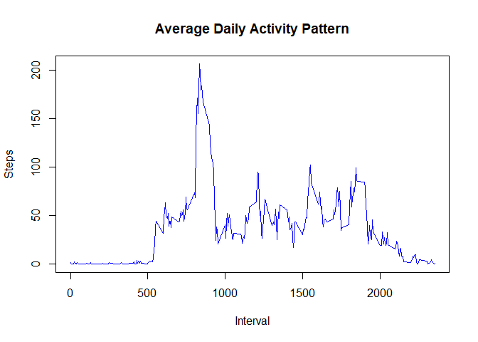
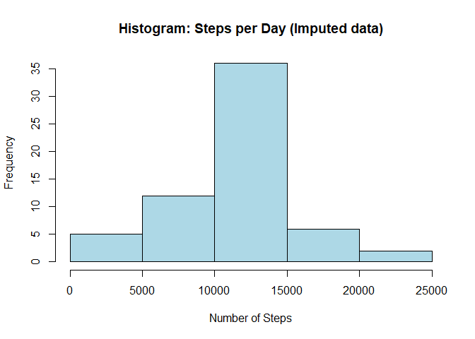

##global options

```r
knitr::opts_chunk$set( fig.path='figure/')
```

## Introduction
It is now possible to collect a large amount of data about personal movement using activity monitoring devices such as a Fitbit, Nike Fuelband, or Jawbone Up. These type of devices are part of the "quantified self" movement -- a group of enthusiasts who take measurements about themselves regularly to improve their health, to find patterns in their behavior, or because they are tech geeks. But these data remain under-utilized both because the raw data are hard to obtain and there is a lack of statistical methods and software for processing and interpreting the data.

This assignment makes use of data from a personal activity monitoring device. This device collects data at 5 minute intervals through out the day. The data consists of two months of data from an anonymous individual collected during the months of October and November, 2012 and include the number of steps taken in 5 minute intervals each day.

## Data
The data for this assignment can be downloaded from the course web site:

Dataset: [Activity monitoring data](https://d396qusza40orc.cloudfront.net/repdata%2Fdata%2Factivity.zip)
The variables included in this dataset are:

steps: Number of steps taking in a 5-minute interval (missing values are coded as NA)  

date: The date on which the measurement was taken in YYYY-MM-DD format  

interval: Identifier for the 5-minute interval in which measurement was taken  

The dataset is stored in a comma-separated-value (CSV) file and there are a total of 17,568 observations in this dataset.  

## Purpose: Analyze the data and answer the following questions  
### What is mean total number of steps taken per day?  
### What is the average daily activity pattern?  
### Are there differences in activity patterns between weekdays and weekends?  


## Loading and preparing the data
Unzip the zip file to extract data


```r
library("data.table")
library(ggplot2)

fileUrl <- "https://d396qusza40orc.cloudfront.net/repdata%2Fdata%2Factivity.zip"
download.file(fileUrl, destfile = paste0(getwd(), '/repdata%2Fdata%2Factivity.zip'), method = "curl")
unzip("repdata%2Fdata%2Factivity.zip",exdir = "data")
```

## Reading csv Data into Data.Table. 

```r
activityDataset <- data.table::fread(input = "data/activity.csv")
```

## What is mean total number of steps taken per day? 

1. Calculate the total number of steps taken per day and ignore the missing values in the dataset.


```r
TotalSteps <- tapply(activityDataset$steps, activityDataset$date, sum)
head(TotalSteps, 10)
```

```
## 2012-10-01 2012-10-02 2012-10-03 2012-10-04 2012-10-05 2012-10-06 2012-10-07 
##         NA        126      11352      12116      13294      15420      11015 
## 2012-10-08 2012-10-09 2012-10-10 
##         NA      12811       9900
```

2. Make a histogram of the total number of steps taken each day. 


```r
hist(TotalSteps, xlab = "Number of Steps", main = "Histogram: Steps per Day", col = "Lightblue")
```

<!-- -->

3. Calculate and report the mean and median of the total number of steps taken per day

```r
MeanSteps <- mean(TotalSteps, na.rm = TRUE)
MedianSteps <- median(TotalSteps, na.rm = TRUE)
```

The mean and median number of steps per day are 1.0766189\times 10^{4} and 10765, respectively.

## What is the average daily activity pattern?

1. Make a time series plot (i.e. 𝚝𝚢𝚙𝚎 = "𝚕") of the 5-minute interval (x-axis) and the average number of steps taken, averaged across all days (y-axis)


```r
IntervalDataset <- tapply(activityDataset$steps, activityDataset$interval, mean, na.rm = TRUE)
plot(as.numeric(names(IntervalDataset)), 
     IntervalDataset, 
     xlab = "Interval", 
     ylab = "Steps", 
     col="blue",
     main = "Average Daily Activity Pattern", 
     type = "l")
```

<!-- -->

2. Which 5-minute interval, on average across all the days in the dataset, contains the maximum number of steps?


```r
max_Interval <- names(sort(IntervalDataset, decreasing = TRUE)[1])
max_Steps <- sort(IntervalDataset, decreasing = TRUE)[1]
```
The min interval and max number of steps per day are 835 and 206.1698113, respectively.

## add/update missing values

1. Calculate and report the total number of missing values in the dataset (i.e. the total number of rows with 𝙽𝙰s)


```r
MissingValues <- sum(is.na(activityDataset$steps))
```

There are 2304 missing values in the dataset.

2. Devise a strategy for filling in all of the missing values in the dataset. The strategy does not need to be sophisticated. For example, you could use the mean/median for that day, or the mean for that 5-minute interval, etc.

Fill missing values with mean number of steps for all days by interval.


```r
# Filling in missing values with mean 
StepsPerInterval <- tapply(activityDataset$steps, activityDataset$interval, mean, na.rm = TRUE)
activityDatasetSplit <- split(activityDataset, activityDataset$interval)

for(i in 1:length(activityDatasetSplit)){
    activityDatasetSplit[[i]]$steps[is.na(activityDatasetSplit[[i]]$steps)] <- StepsPerInterval[i]
}
```

3. Create a new dataset that is equal to the original dataset but with the missing data filled in.


```r
activityDatasetImputed <- do.call("rbind", activityDatasetSplit)
activityDatasetImputed <- activityDatasetImputed[order(activityDatasetImputed$date) ,]

StepsPerDayImputed <- tapply(activityDatasetImputed$steps, activityDatasetImputed$date, sum)
```

4. Make a histogram of the total number of steps taken each day and calculate and report the mean and median total number of steps taken per day. Do these values differ from the estimates from the first part of the assignment? 


```r
hist(StepsPerDayImputed, xlab = "Number of Steps",col="Lightblue", main = "Histogram: Steps per Day (Imputed data)")
```

<!-- -->

```r
MeanPerDayImputed <- mean(StepsPerDayImputed, na.rm = TRUE)
MedianPerDayImputed <- median(StepsPerDayImputed, na.rm = TRUE)
```


4.1 What is the impact of imputing missing data on the estimates of the total daily number of steps?
The mean and median number of steps per day are 1.0766189\times 10^{4} and 1.0766189\times 10^{4}, respectively. I think Mean did not change but the Median increased slightly. 


## Are there differences in activity patterns between weekdays and weekends?

1. Create a new factor variable in the dataset with two levels – “weekday” and “weekend” indicating whether a given date is a weekday or weekend day.


```r
# recreating dataset from scratch then making the new factor variable

activityDatasetImputed$day <- ifelse(weekdays(as.Date(activityDatasetImputed$date)) == "Saturday" | weekdays(as.Date(activityDatasetImputed$date)) == "Sunday", "weekend", "weekday")
head(activityDatasetImputed[activityDatasetImputed$day=="weekend"])
```

```
##    steps       date interval     day
## 1:     0 2012-10-06        0 weekend
## 2:     0 2012-10-06        5 weekend
## 3:     0 2012-10-06       10 weekend
## 4:     0 2012-10-06       15 weekend
## 5:     0 2012-10-06       20 weekend
## 6:     0 2012-10-06       25 weekend
```

```r
head(activityDatasetImputed[activityDatasetImputed$day=="weekday"])
```

```
##        steps       date interval     day
## 1: 1.7169811 2012-10-01        0 weekday
## 2: 0.3396226 2012-10-01        5 weekday
## 3: 0.1320755 2012-10-01       10 weekday
## 4: 0.1509434 2012-10-01       15 weekday
## 5: 0.0754717 2012-10-01       20 weekday
## 6: 2.0943396 2012-10-01       25 weekday
```

2. Make a panel plot containing a time series plot (i.e. 𝚝𝚢𝚙𝚎 = "𝚕") of the 5-minute interval (x-axis) and the average number of steps taken, averaged across all weekday days or weekend days (y-axis). See the README file in the GitHub repository to see an example of what this plot should look like using simulated data.


```r
# Set a 2 panel plot
par(mfrow=c(1,2))

# calculate avg steps for weekend
StepsPerIntervalWeekend <- tapply(activityDatasetImputed[activityDatasetImputed$day == "weekend" ,]$steps, activityDatasetImputed[activityDatasetImputed$day == "weekend" ,]$interval, mean, na.rm = TRUE)

# calculate avg steps for weekend
StepsPerIntervalWeekDay <- tapply(activityDatasetImputed[activityDatasetImputed$day == "weekday" ,]$steps, activityDatasetImputed[activityDatasetImputed$day == "weekday" ,]$interval, mean, na.rm = TRUE)

plot(as.numeric(names(StepsPerIntervalWeekDay)), 
     StepsPerIntervalWeekDay, 
     xlab = "Interval", 
     ylab = "Steps", 
     main = "Activity Pattern (Weekdays)", 
     type = "l")

plot(as.numeric(names(StepsPerIntervalWeekend)), 
     StepsPerIntervalWeekend, 
     xlab = "Interval", 
     ylab = "Steps", 
     main = "Activity Pattern (Weekends)", 
     type = "l")
```

<!-- -->
